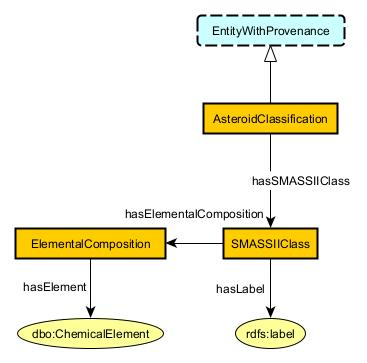
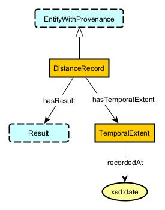
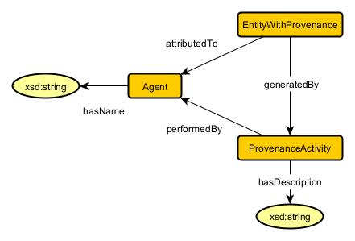
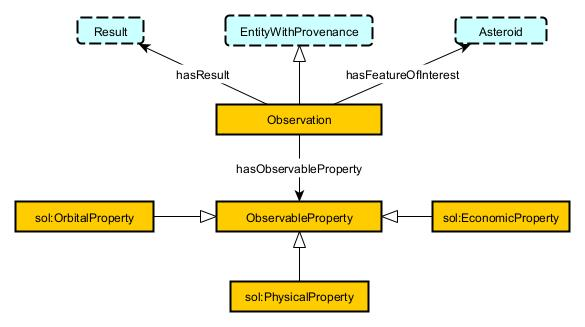

# SOL of Life
**Authors:** Dave, Brandon Daniel, Miller, Ryan E., Noble, Megan T.

## Use Case Scenario
### Narrative 
The rich minerals on Earth remain a non-renewable resource for humans as they continue to refine the currently available resources to build products from everyday use items to hardware for technological advances. Due to the limited availability of rich minerals, humans will eventually need to branch out from Earth to other planetary bodies for mineral excavations. SOL Of Life plans to support the missions of space exploration and research by providing a tool to query collected data of asteroids within Sol, our solar system. Users of our tool could range anywhere from government entities, researchers, analysts, other space research institutions, and space enthusiasts. 

The available research and data can be cumbersome to navigate through. A knowledge graph is interesting in the case of mining in space because it is an uncharted frontier. There are so many questions that are difficult to answer surrounding the viability and cost. A knowledge graph would provide a method for answering those questions without the need for a specialized analyst to go out and make the various connections themselves from the existing research and data.

Our focus is on asteroids that can be found within approximately 2AU of Earth because of their potential for containing valuable minerals and a wealth of existing data. As defined by NASA, an asteroid exists as a space rock that orbits the sun with a size between 10 meters and 530 kilometers. 

Open source data provided by researchers and institutions such as Neil deGrasse Tyson, NASA, and Space Force, can be re-purposed into a knowledge graph to provide insight into excavation missions. With all of the data gathered together, the knowledge graph helps to filter the information into a readable state. Data that includes celestial body mineralogy predicted from infrared readings combined with data of the body’s trajectory path could be used together for humans to plan space missions in order to send out spacecrafts for mining expeditions. We also hope to serve humans of Planet Earth against celestial bodies that may be on a course for impact into the planet.  

### Competency Questions
1. What are the top 5 most frequently occuring minerals within 1.5 astronomical units from Earth in 2024?
2. What are the top 3 most occuring asteroid types within 1.5au from Earth in 2025?
3. Which is the closest asteroid to Earth in the next 24 months and when does that occur?
4. What are the 5 closest asteroids that may contain iron?
5. What are the 3 most potentially profitable asteroids within 0.75au of Earth in 2024?  
6. When will 162173 Ryugu be within 1au of Earth?
7. How long will 162173 Ryugu be within 1au of Earth?
8. Based on current trajectory of 162173 Ryugu, how far from Earth will 162173 Ryugu be in 8 months?
9. How much time is available until the 162173 Ryugu is within 1au of Earth?
10. Which asteroid is the first to come within 0.5au of Earth that contains iron?

### Integrated Datasets
1. Asterank: https://www.asterank.com/
2. NASA Small Body Database: https://ssd.jpl.nasa.gov/tools/sbdb_lookup.html#/  
3. MP3C Asteroid Database: https://mp3c.oca.eu/
4. SkyLive: https://theskylive.com/
5. Asteroid Spectral Types:  https://en.wikipedia.org/wiki/Asteroid_spectral_types

## Modules
<!-- There should be one module section per module (essentially per key-notion) -->

### Asteroid
**Source Pattern:** Feature of Interest  
**Source Data:** Asterank, MP3C, NASA_JPL  

#### Description
The domain of space objects are broken into three subcategories: Artificial Space Objects, Space Weather Phenomena, and Natural Space Objects.  Asteroids exist as a Natural Space Object where object can be further defined as a material object.  An Asteroid is represented by NASA as an object that orbits the sun of the Sol Solar System measuring 33 feet (10 meters) to 329 miles (530 kilometers).  For the SOL of Life, the only celestial body to be concerned with is Asteroid; therefore, the derived understanding begins with an OWL Thing consisting of multiple properties; such as, labeled naming conventions and quantitative measurable components of velocity, semi-major axis, and minimum orbit intersection distance.  Researchers have also predicted properties that benefit exomining operations such as the average profit gained after a mining excavation with consideration of the available valuable materials.  A subsumption is made for Asteroids into Near-Earth Asteroids when their semi-major axis measurement is within a threshold.  The SOSA pattern best reflects the usage of SOL of Life's knowledge graph with respect to the layer of Observations. Asteroids can be represented as a Feature of Interest with a Observations, a Classification, and a Distance Record.  
  

#### Axioms
1. * `Asteroid SubClassOf FeatureOfInterest`  
Every Asteroid is a Feature of Interest.
2. * `NearEarthAsteroid SubClassOf Asteroid`  
Every NearEarthAsteroid is an Asteroid.
3. * `Asteroid SubClassOf hasNumericID only xsd:int`  
The scoped range of hasNumericID, scoped by Asteroid, is an xsd:integer.
4. * `Asteroid SubClassOf hasNumericID exactly 1 xsd:int`  
Every Asteroid has exactly 1 Numeric ID. 
5. * `Asteroid SubClassOf hasCommonName only rdfs:Literal`  
The scoped range of hasCommonName, scoped by Asteroid, is an rdfs:Literal
6. * `Asteroid SubClassOf hasCommonName max 1 rdfs:Literal`  
Every Asteroid has at maximum 1 Common Name. 
7. * `Asteroid SubClassOf hasDiscoveryName only rdfs:Literal`  
The scoped range of hasDiscoveryName, scoped by Asteroid, is an rdfs:Literal
8. * `Asteroid SubClassOf hasDiscoveryName exactly 1 rdfs:Literal`  
Every Asteroid has exactly 1 Discovery Name.
9. * `Asteroid SubClassOf hasAsteroidClassification only AsteroidClassification`  
The scoped range of hasAsteroidClassification, scoped by Asteroid, is AsteroidClassification
10. * `Asteroid SubClassOf hasAsteroidClassification exactly 1 AsteroidClassification`  
Every Asteroid has exactly 1 AsteroidClassification.
11. * `Asteroid SubClassOf hasDistanceRecord only DistanceRecord`  
The scoped range of hasDistanceRecord, scoped by Asteroid, is DistanceRecord
12. * `Asteroid SubClassOf hasDistanceRecord min 0 DistanceRecord`  
Every Asteroid has at minimum 0 DistanceRecord.
13. * `Asteroid SubClassOf hasObservation only Observation`  
The scoped range of hasObservation, scoped by Asteroid, is Observation
14. * `Asteroid SubClassOf hasObservation min 1 Observation`  
Every Asteroid has at minimum 1 Observation.

### AsteroidClassification
**Source Pattern:** No Source Pattern  
**Source Data:** Asterank, Asteroid Spectral Types  

#### Description
The derived elemental composition of an Asteroid is a prediction based from infrared readings, as traveling to each individual asteroid remains an unrealistic task. As such, infrared reflections and readings are compared for similarities against known Earth elements and denote the components from the Asteroid's surface. The infrared data has been collected to formulate classifications among clusters of all asteroids for similarities of readings. The infrared readings and cluster family of similar asteroids result in a SMASSII classification which can be represented as a label. For our use case, we're only interested in the asteroid type as a label and decided to disregard the initial observation that lead to the classification.  

#### Axioms
1. * `AsteroidClassification SubClassOf EntityWithProvenance`  
Every AsteroidClassification is an Entity With Provenance .
2. * `AsteroidClassification SubClassOf hasSMASSIIClass only SMASSIIClass`  
The scoped range of hasSMASSIIClass, scoped by AsteroidClassification, is SMASSIIClass.
3. * `AsteroidClassification SubClassOf hasSMASSIIClass exactly 1 SMASSIIClass`  
Every AsteroidClassification has exactly 1 SMASSII Class.
4. * `ElementalComposition SubClassOf derivesFrom min 1 SMASSIIClass`  
Every ElementalComposition is derived from at minimum 1 SMASSII Class.
5. * `ElementalComposition SubClassOf hasElement only dbo:ChemicalElement`  
The scoped range of hasElement, scoped by ElementalComposition, is dbo:ChemicalElement.
6. * `ElementalComposition SubClassOf hasElement min 1 dbo:ChemicalElement`  
Every ElementalComposition has at minimum 1 Element.
7. * `SMASSIIClass SubClassOf hasElementalComposition only ElementalComposition`  
The scoped range of hasElementalComposition, scoped by SMASSIIClass, is ElementalComposition.
8. * `SMASSIIClass SubClassOf hasElementalComposition exactly 1 ElementalComposition`  
Every SMASSIIClass has exactly 1 ElementalComposition.
9. * `SMASSIIClass SubClassOf hasLabel only rdfs:Literal`  
The scoped range of hasLabel, scoped by SMASSIIClass, is an rdfs:Literal.
10. * `SMASSIIClass SubClassOf hasLabel exactly 1 rdfs:Literal`  
Every SMASSIIClass has exactly 1 Label.

### DistanceRecord
**Source Pattern:** MODL's Record  
**Source Data:** SkyLive  

#### Description
The end-goal of SOL of Life is to provide insight at a specific point of time for whether an Asteroid is within a means of distance for exomining companies to travel to for mineral extraction operations. As such, the spatial coordinates of an Asteroid is less important than the actual distance from Earth, which acts as a baseline for exomining operations. We used the Record pattern for distance from Earth because it accounts for some Event that occurs at a specific point in time. For our ontology, the Event is simplified as a result for a quantifiable metric for distance from Earth.  

#### Axioms
1. * `DistanceRecord SubClassOf EntityWithProvenance`  
Every DistanceRecord is an Entity With Provenance.
2. * `DistanceRecord SubClassOf hasResult exactly 1 Result`  
Every DistanceRecord has exactly 1 Result.
3. * `DistanceRecord SubClassOf hasTemporalExtent only TemporalExtent`  
The scoped range of hasTemporalExtent, scoped by DistanceRecord, is TemporalExtent.
4. * `DistanceRecord SubClassOf hasTemporalExtent exactly 1 TemporalExtent`  
Every DistanceRecord has exactly 1 Temporal Extent.
5. * `TemporalExtent SubClassOf recordedAt only xsd:dateTime`  
The scoped range of recordedAt, scoped by TemporalExtent, is an xsd:date.  
6. * `TemporalExtent SubClassOf recordedAt exactly 1 xsd:dateTime`  
Every TemporalExtent has exactly 1 xsd:date.  

### EntityWithProvenance
**Source Pattern:** MODL's Entity With Provenance  
**Source Data:** Asterank, MP3C, NASA_JPL  

#### Description
Attributes of asteroids can fit into the Entity With Provenance pattern provided by MODL. Most of our data is gathered by experts in astronomy, such as NASA and MP3C. Using this pattern allows for our end users to trace our data back to a source and the agent or organization that performed the data collection.  

#### Axioms
1. * `EntityWithProvenance SubClassOf generatedBy only ProvenanceActivity`  
The scoped range of generatedBy, scoped by EntityWithProvenance, is ProvenanceActivity.
2. * `EntityWithProvenance SubClassOf generatedBy exactly 1 ProvenanceActivity`  
Every EntityWithProvenance is generated by exactly 1 Provenance Activity.
3. * `EntityWithProvenance SubClassOf attributedTo only Agent`  
The scoped range of attributedTo, scoped by EntityWithProvenance, is Agent.
4. * `EntityWithProvenance SubClassOf attributedTo exactly 1 Agent`  
Every EntityWithProvenance is attributed to by exactly 1 Agent.
5. * `ProvenanceActivity SubClassOf performedBy only Agent`  
The scoped range of performedBy, scoped by ProvenanceActivity, is Agent.
6. * `ProvenanceActivity SubClassOf performedBy exactly 1 Agent`  
Every ProvenanceActivity is performed by exactly 1 Agent.
7. *  `ProvenanceActivity SubClassOf hasDescription only xsd:string`  
The scoped range of hasDescription, scoped by ProvenanceActivity, is an xsd:string.
8. *  `ProvenanceActivity SubClassOf hasDescription exactly 1 xsd:string`  
Every ProvenanceActivity has exactly 1 Description.
9. *  `Agent SubClassOf hasName only xsd:string`  
The scoped range of hasName, scoped by Agent, is an xsd:string.
10. *  `Agent SubClassOf hasName exactly 1 xsd:string`  
Every Agent has exactly 1 Name.

### Observation
**Source Pattern:** SOSA Observation  
**Source Data:** Asterank, MP3C, NASA_JPL  

#### Description
Data that describes Asteroids can be represented as Observations from the SOSA pattern which consists of the property that describes the observation along with the quantifiable value. The description of the property follows SOSA's ObservableProperty pattern, and the value follows the aforementioned Result pattern.  With that in mind, the measurable data; such as, mass, value, and velocity are represented as an instance of an Observation.  
  

#### Axioms
1. * `Observation SubClassOf hasFeatureOfInterest only Asteroid`  
The scoped range of hasFeatureOfInterest, scoped by Observation, is Asteroid.
2. * `Observation SubClassOf hasFeatureOfInterest exactly 1 Asteroid`  
Every Observation has exactly 1 Feature of Interest, which is an Asteroid.
3. * `Observation SubClassOf hasObservableProperty only ObservableProperty`  
The scoped range of hasObservableProperty, scoped by Observation, is ObservableProperty.
4. * `Observation SubClassOf hasObservableProperty exactly 1 ObservableProperty`  
Every Observation has exactly 1 ObservableProperty.
5. * `Observation SubClassOf hasResult exactly 1 Result`  
Every Observation has exactly 1 Result.
6. * `Observation SubClassOf EntityWithProvenance`  
Every Observation is an Entity With Provenance.
7. * `EconomicProperty SubClassOf ObservableProperty`  
Every EconomicProperty is an Observable Property.
8. * `OrbitalProperty SubClassOf ObservableProperty`  
Every OrbitalProperty is an Observable Property.
9. * `PhysicalProperty SubClassOf ObservableProperty`  
Every PhysicalProperty is an Observable Property.

### Result
**Source Pattern:** MODL's Result and Quantity  
**Source Data:** Asterank, MP3C, NASA_JPL  

#### Description
A Result pattern is used to describe the quantifiable values in the properties of an Asteroid. In our case, the Result notion has a Quantity associated with it, which is a pattern in MODL. A Quantity consists of a Quantity Kind, which is the description indicating the Result's usage, along with the quantifiable value and unit of measurement. Similarly to how controlled vocabularies are used in the Enslaved Ontology, we implement them as a means of scalability of our ontology. They are considered to be separate from the actual ontology yet complement it. A Quantity Kind as controlled vocabulary can consist of, but is not limited to mass, distance from Earth, and velocity. A Unit as controlled vocabulary can consist of, but is not limited to km/s, kg, and AU.  

#### Axioms
1. *  `Quantity SubClassOf hasQuantityValue only QuantityValue`  
The scoped range of hasQuantityValue, scoped by Quantity, is QuantityValue.
2. *  `Quantity SubClassOf hasQuantityKind only QuantityKind`  
The scoped range of hasQuantityKind, scoped by Quantity, is QuantityKind.
3. *  `Quantity SubClassOf hasQuantityKind exactly 1 QuantityKind`  
Every Quantity has exactly 1 Quantity Kind.
4. *  `Result SubClassOf hasQuantity only Quantity`  
The scoped range of hasQuantity, scoped by Result, is Quantity.
5. *  `Quantity SubClassOf hasQuantityValue exactly 1 QuantityValue`  
Every Quantity has exactly 1 Quantity Value.
6. *  `Result SubClassOf hasQuantity exactly 1 Quantity`  
Every Result has exactly 1 Quantity.
7. *  `QuantityValue SubClassOf hasNumericValue only xsd:double`  
The scoped range of hasNumericValue, scoped by QuantityValue, is an xsd:double.
8. *  `QuantityValue SubClassOf hasNumericValue exactly 1 xsd:double`  
Every QuantityValue has exactly 1 Numeric Value.
9. *  `QuantityValue SubClassOf hasUnit only Unit`  
The scoped range of hasUnit, scoped by QuantityValue, is Unit.
10. *  `QuantityValue SubClassOf hasUnit exactly 1 Unit`  
Every QuantityValue has exactly 1 Unit.
11. *  `Result SubClassOf  inverse (hasResult) exactly 1 (Observation or DistanceRecord)`  
Every Result belongs to exactly 1 Observation or DistanceRecord.

#### Remarks
* A result can be associated with a DistanceRecord or an Observation

## The Overall Knowledge Graph
### Namespaces
* @base <http://www.soloflife.org> .
* @prefix sol-ont: <http://soloflife.org/lod/ontology/> .
* @prefix sol-qk: <http://soloflife.org/lod/quantitykinds> .
* @prefix sol-unit: <http://soloflife.org/lod/units> .
* @prefix solr: <http://soloflife.org/lod/resource/> .

### All-Together

