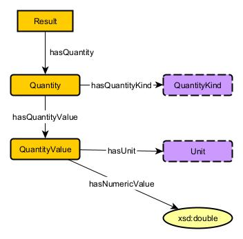

# Table of Contents
1. [Asteroid Schema](#Asteroid)
2. [AsteroidClassification Schema](#AsteroidClassification)
3. [DistanceRecord Schema](#DistanceRecord)
4. [EntityWithProvenance](#EntityWithProvenance)
6. [Observation Schema](#Observation)
7. [Result Schema](#Result)
8. [All-Together Schema](#all-together)

## Asteroid
  

## AsteroidClassification

## DistanceRecord

## EntityWithProvenance

## Observation
  

## Result

## All-Together

