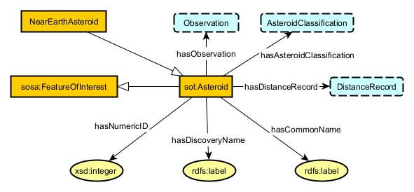

# Table of Contents
1. [Asteroid Schema](#asteroid-and-observations)
2. [ObservableProperiy Instances](#observableproperty-instances)
3. [Classification Schema](#asteroidclassification)
4. [DistanceRecording Schema](#distancerecording)
5. [All-Together Schema](#all-together)

## Asteroid
  

## Observation
  

## AsteroidClassification
  

## DistanceRecording

## EntityWithProvenance

## All-Together

