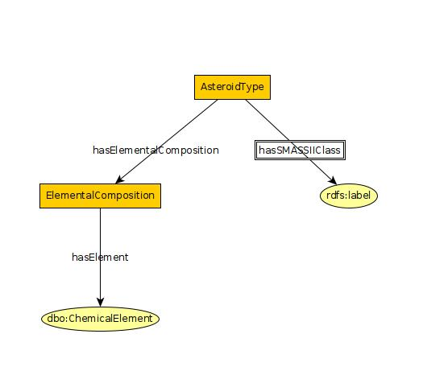

# Table of Contents
1. [Asteroid Schema](#Asteroid)
2. [Classification Schema](#AsteroidClassification)
2. [DistanceRecording Schema](#DistanceRecording)
2. [All-Together Schema](#All-Together)

## Asteroid
  

## AsteroidClassification
  

## DistanceRecording

## All-Together
